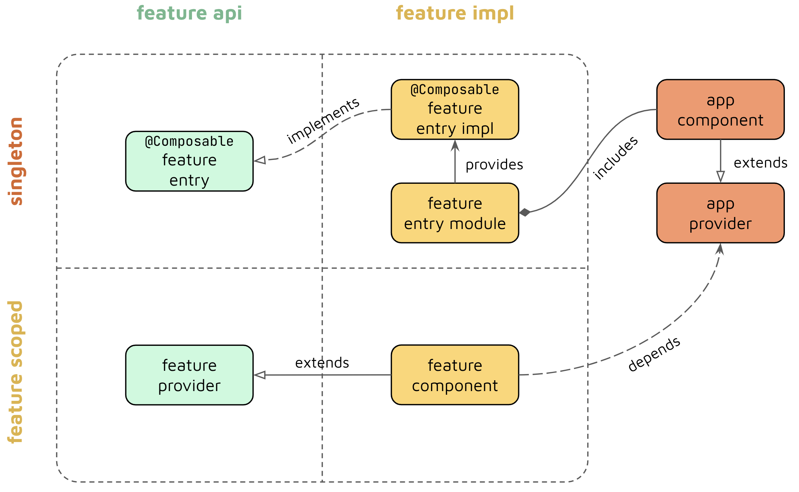

**SimpleMovies: Practice Jetpack Compose with The Movie DB**

This project is a hands-on exploration of building a scalable Android app using Jetpack Compose. You'll gain practical experience with various technologies and architectural patterns by following along.


**Getting Started**

1. **Obtain Your API Key:** Head over to The Movie DB's developer portal to acquire an API key. You'll need this to interact with their movie database.
2. **Set Up Local Development:** Create a `local.properties` file within your project's root directory and add the following line, replacing `API_KEY` with your actual key:

   ```properties
   tmdb_api_key=YOUR_API_KEY
   ```

**Technologies in Action**

- **Kotlin:** The project utilizes Kotlin, a modern and concise language streamlining Android development.
- **Jetpack Compose:** We'll delve into Jetpack Compose, a declarative UI framework that simplifies building beautiful and responsive Android app interfaces.
- **Compose Paging:** Master the art of handling large datasets efficiently by implementing paginated UI lists with Compose Paging.
- **Coil:** Learn how to effectively load and display images within your Compose UI using Coil, a performant image loading library.
- **Compose Navigation:** Explore seamless navigation between different screens and features within your app using Compose Navigation.
- **Kotlin Coroutines:** As you progress, you'll encounter the power of Kotlin Coroutines for managing asynchronous tasks and maintaining clean code.
- **Dagger 2 (without Hilt):** Gain practical experience with dependency injection using Dagger 2, a popular tool for managing dependencies in your project.
- **Retrofit:** Discover how to interact with web APIs using Retrofit, a powerful networking library for Android.
- **Room:** Explore Room, a persistence library that allows you to store and retrieve data locally within your app, enabling an offline mode.

**Understanding the Architecture**

This project adopts a scalable, multi-module architecture, promoting code organization and maintainability. Let's break down the different module types:

- **Feature Modules:** These modules encapsulate the logic for specific functionalities within your app. Each feature module can be further divided into:
    - **API Modules(entry):** These modules define framework-agnostic interfaces, acting as entry points for feature-related logic. They are lightweight and independent of any particular UI framework.
    - **Impl Modules(implementation):** These modules house the actual implementation details of the feature, including UI components and business logic, tailored to the chosen UI framework (in this case, Jetpack Compose).
- **Library Modules:** These modules contain reusable code that can be shared across various features within your app.
- **Injector Modules:** These modules establish the dependency graph for the application. The `app` module typically falls into this category.


